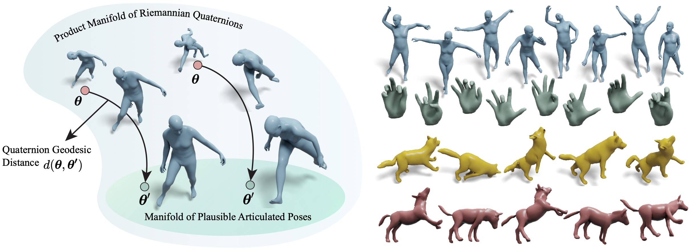

<!-- HEADER -->
<p align="center">
    <h1 align="center">NRDF: Neural Riemannian Distance Fields for Learning Articulated Pose Priors</h1>
    <!-- authors -->
    <p align="center">
        <a href="https://virtualhumans.mpi-inf.mpg.de/people/He.html"><b>Yannan He</b></a>
        &emsp;
        <a href="https://virtualhumans.mpi-inf.mpg.de/people/Tiwari.html"><b>Garvita Tiwari</b></a>
        &emsp;
        <a href="https://www.imperial.ac.uk/people/t.birdal"><b>Tolga Birdal</b></a>
        &emsp;
        <a href="https://janericlenssen.github.io/"><b>Jan Eric Lenssen</b></a>
        &emsp;
        <a href="https://virtualhumans.mpi-inf.mpg.de/people/pons-moll.html"><b>Gerard Pons-Moll</b></a>
    </p>
    <!-- conference -->
    <h3 align="center"> CVPR 2024 (Highlight) </h3>
    <!-- teaser -->
    <p align="center">
        
    </p>
    <!-- badges -->
    <p align="center">
        <a href="https://arxiv.org/abs/2403.03122">
            
        </a>
        &emsp;
        <a href="https://virtualhumans.mpi-inf.mpg.de/nrdf/">
            
        </a>
        &emsp;
    </p>
</p>

## News
* [2024-07-19] Added evaluation metrics
* [2024-05-09] Code and pretrained models are released!

## Install
The steps are described in [docs/installation.md](./docs/installation.md).

## Download pre-trained models

The pre-trained NRDF model can be obtained from the [link](https://nc.mlcloud.uni-tuebingen.de/index.php/s/cxDEsezSXtDJfKt) (amass_softplus...)

You can extract the downloaded NRDF model into a manually created folder `checkpoints` within the project directory

#### Folder structure:

```bash
NRDF
├── lib
├── examples
├── checkpoints
│   ├── amass_softplus_l1_0.0001_10000_dist0.5_eik0.0_man0.1
│   │   ├── checkpoints
│   │   │   ├── checkpoint_epoch_best.tar
│   │   ├── config.yaml
├── ...
```


## Data downloading and processing
The steps are described in [docs/data.md](./docs/data.md).


## Training
Use the following command to train your own model:
```bash
python lib/core/train_nrdf.py --config=configs/train.yaml
```

Modify `data_dir`, `amass_dir` and `experiment/root_dir` with your own paths before training.

## Pose denoising
Use the following command to denoise noisy poses:
```bash
python lib/exp/pose_den.py --noisy_data_path <YOUR_DATA_PATH> --model_dir <MODEL_DIR> --bm_path <SMPL_MODEL_DIR> --step_size 0.01 --iterations 200 --device cuda
```

**Notes:**

* `noisy_data_path`: path to the input noisy poses, default: examples/noisy_pose.npz
* `model_dir`: directory of the pre-trained NRDF model, default: checkpoints/amass_softplus_l1_0.0001_10000_dist0.5_eik0.0_man0.1
* `bm_path`: directory of the SMPL model
* Results will be saved in `outputs/`

## Diverse pose generation
Use the following command to generate diverse poses by using NRDF:
```bash
python lib/exp/sample_poses.py --num_samples 500 --model_dir <MODEL_DIR> --step_size 0.01 --iterations 200 --device cuda
```

**Notes:**

* `model_dir`: directory of the pre-trained NRDF model, default: checkpoints/amass_softplus_l1_0.0001_10000_dist0.5_eik0.0_man0.1
* Results will be saved in `outputs/`

## Inverse kinematics from partial observations
Use the following command to solve IK from partial markers:
```bash
python lib/exp/partial_ik.py --input_path <YOUR_INPUT_PATH> --model_dir <MODEL_DIR> --bm_path <YOUR_SMPL_MODEL_PATH> --occ_type left_arm_occ --obs_type marker --device cuda
```

**Notes:**

* `input_path`: path to the given ground truth poses, default: examples/ik_pose.npz
* `model_dir`: directory of the pre-trained NRDF model, default: checkpoints/amass_softplus_l1_0.0001_10000_dist0.5_eik0.0_man0.1
* `bm_path`: directory of the SMPL model
* Results will be saved in `outputs/`


## Monocular 3D pose estimation from images

Coming soon


## Citation
Cite us if you find this repository is helpful to your project:
````BibTeX
@inproceedings{he24nrdf,
    title = {NRDF: Neural Riemannian Distance Fields for Learning Articulated Pose Priors},
    author = {He, Yannan and Tiwari, Garvita and Birdal, Tolga and Lenssen, Jan Eric and Pons-Moll, Gerard},
    booktitle = {Conference on Computer Vision and Pattern Recognition ({CVPR})},
    year = {2024},
}
````


## Acknowledgements


Here are some great resources we benefit from:
* [Pose-NDF v2 implementation](https://github.com/garvita-tiwari/PoseNDF/tree/version2): neural distance field model;
* [AMASS](https://amass.is.tue.mpg.de/) dataset;
* [VPoser](https://github.com/nghorbani/human_body_prior): inverse kinematics code frame;
* [MoSh++](https://github.com/nghorbani/moshpp): index of markers on the SMPL body surface;
* [pytorch3d](https://github.com/facebookresearch/pytorch3d): conversions between quaternion and axis-angle;